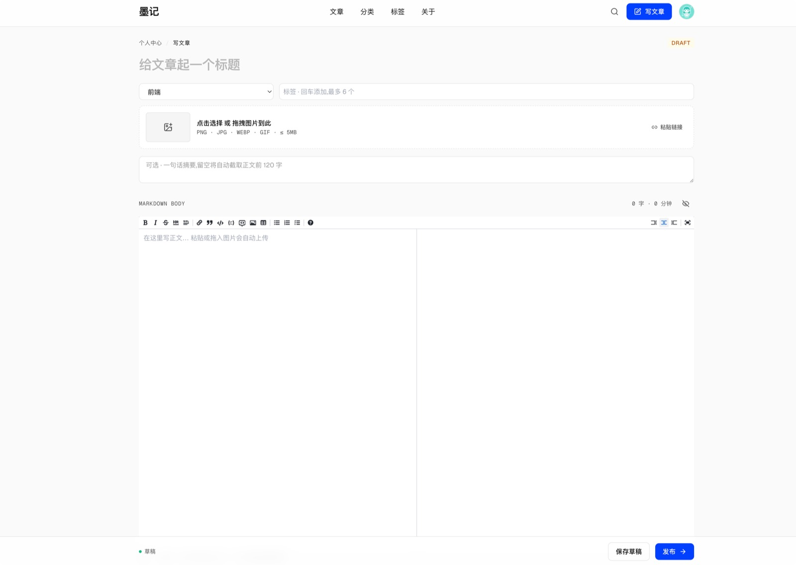
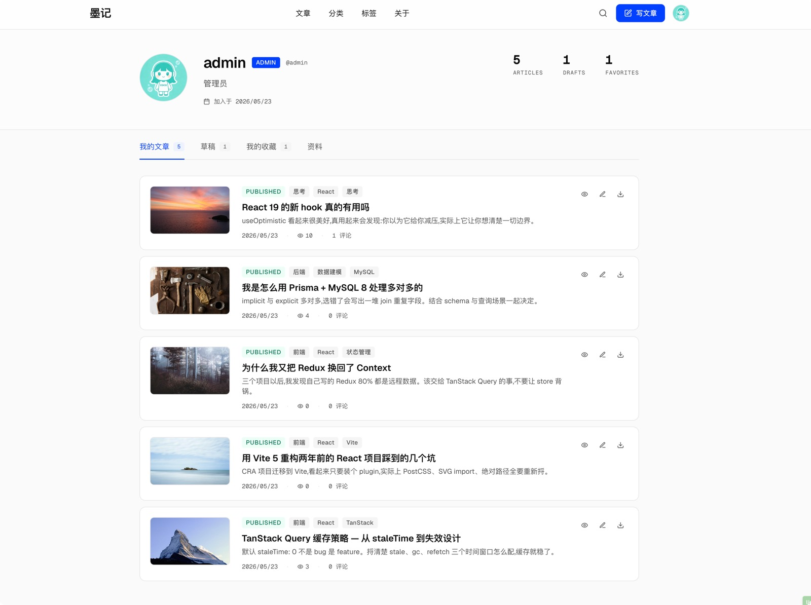
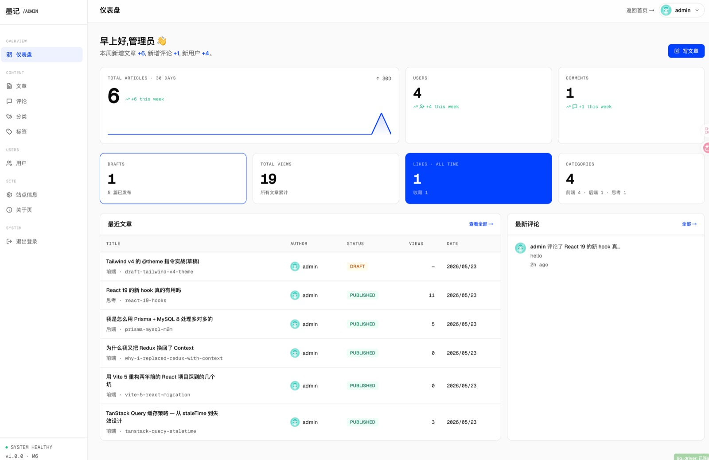
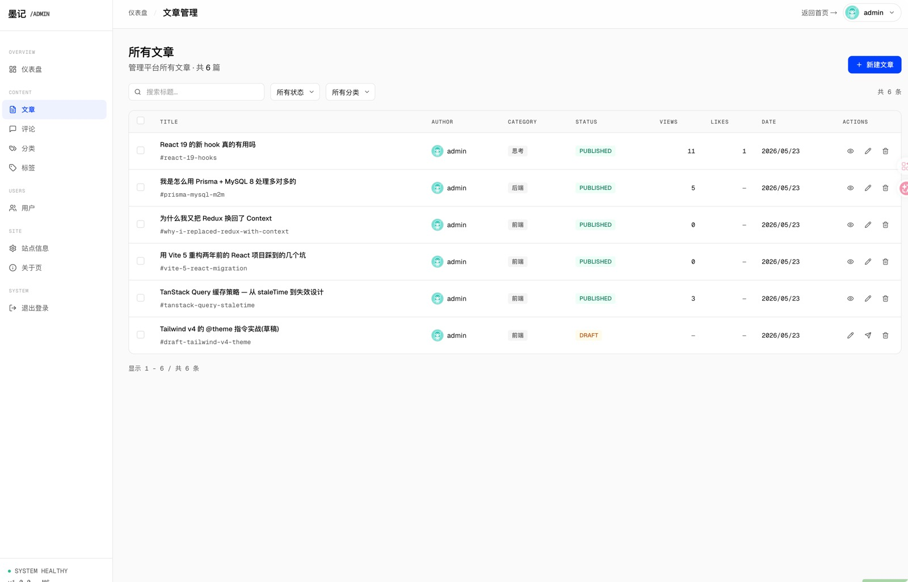

# 墨记 · Slow Blog


一个慢工出细活的个人博客系统 — 写一点东西,把每行都写明白。**站点信息 / 关于页 / 用户资料全部在后台可改**。

---

## 界面预览

|                               首页 zigzag 列表                                |                                 文章详情 + TOC                                  |
| :---------------------------------------------------------------------------: | :-----------------------------------------------------------------------------: |
|           [](mockups/preview/home.jpg)           |  [](mockups/preview/article-detail.jpg)  |
|                           **写作 · Markdown 双栏**                            |                                 **登录 / 注册**                                 |
|          [](mockups/preview/write.jpg)          |           [](mockups/preview/login.jpg)           |
|                                 **个人中心**                                  |                                 **管理仪表盘**                                  |
|             [](mockups/preview/me.jpg)             | [](mockups/preview/admin-dashboard.jpg) |
|                         **文章管理(批量发布 / 删除)**                         |                                                                                 |
| [](mockups/preview/admin-articles.jpg) |                                                                                 |

设计语言:Aurora AI(Klein 蓝光斑 + 柔色雾化背景)· 细节见 [docs/DESIGN.md](docs/DESIGN.md)。HTML 高保真 mockup 在 [mockups/index.html](mockups/index.html)。

---

## 功能

**阅读侧** · zigzag 文章列表 + 智能分页 / Markdown + 代码高亮 + TOC + 中英文阅读时长 / 分类与标签云 / 全文搜索弹层(`⌘K`,300ms 防抖)+ 完整结果页 / 关于页可改

**写作 / 个人中心** · JWT (HS256, 7d) + bcrypt / `@uiw/react-md-editor` 双栏 / **粘贴 · 拖入图片自动上传**(占位符防错位) / 草稿 / 评论 + 点赞 + 收藏(乐观更新)/ 头像 · 用户名 · 简介 · 自助改密

**管理后台 `/admin`** · Bento 仪表盘 + 30 天发文趋势(自绘 SVG)/ 文章批量发布与删除 / 评论跨文章搜索 / 分类标签 CRUD / 用户管理(头像 · 角色 · 启用 · 重置密码)/ 关于页与站点信息(标题 · 标语 · Logo · Favicon)实时编辑

---

## 快速开始

```bash
pnpm install
cp .env.example .env
pnpm db:up && pnpm db:migrate && pnpm db:seed
pnpm dev
```

- 前端 → http://localhost:5173 · 后端 → http://localhost:4000/api/health
- 种子默认管理员:`admin` / `admin123`(普通用户走 `/register`)
- 灌示例文章:`pnpm -C server db:seed-articles`

---

## 生产部署

```bash
cp .env.production.example .env.production    # JWT_SECRET / DB 密码必须改
docker compose -f docker-compose.prod.yml --env-file .env.production up -d --build
docker exec your-blog-server-prod ./node_modules/.bin/tsx prisma/seed.ts    # 首次种子
```

三个容器:`mysql`(内网) · `server`(内网,Node 20 + Express + Prisma) · `nginx`(80 端口)。Server 启动时自动跑 `prisma migrate deploy`,重启幂等。打开 `http://localhost`(端口可在 env 改 `HTTP_PORT`)。

### HTTPS

把 `fullchain.pem` + `privkey.pem` 放进 `./certs/`(已在 `.gitignore`),叠加 overlay:

```bash
docker compose -f docker-compose.prod.yml -f docker-compose.https.yml \
  --env-file .env.production up -d
```

配置(80→443 跳转 / TLS 1.2+1.3 / HSTS / ACME challenge)+ 证书签发菜谱见 [nginx/nginx.https.conf](nginx/nginx.https.conf) 顶部注释。

### 备份 / 恢复

```bash
bash scripts/backup.sh    # → backups/your-blog-<timestamp>.tar.gz (db + uploads + manifest)
```

恢复流程(解包 → mysql restore → uploads 卷重灌 → server 重启)详见 [scripts/backup.sh](scripts/backup.sh) 顶部注释。配上 cron + rclone 就是完整方案。

---

## 常用脚本

```bash
pnpm dev          # client + server 热重载
pnpm build        # 构建
pnpm typecheck    # 全仓库 TS 类型检查

pnpm db:up        # 启动 MySQL 容器
pnpm db:migrate   # 应用迁移
pnpm db:seed      # 种子 admin / 分类 / 默认关于页
pnpm db:studio    # 浏览数据
pnpm db:reset     # ⚠ 重置数据库 + 重跑迁移 + 种子
```

server e2e 冒烟(curl,server 跑起来直接跑):
`scripts/test-m2-server.sh` · `test-m4-server.sh` · `test-m5-server.sh` · `test-m6-server.sh`

---

## 路线图

| 阶段    | 内容                                                        | 状态                       |
| ------- | ----------------------------------------------------------- | -------------------------- |
| M0 – M7 | 脚手架 → 用户 → 文章 → 列表搜索 → 互动 → 上传 → 后台 → 部署 | ✓                          |
| post-M7 | 作者主页 · 单篇导出 · 一键备份 · HTTPS 反代                 | ✓                          |
| 待办    | 关注作者 · SEO · 整站导出 · ESLint+Husky                    | [ROADMAP](docs/ROADMAP.md) |

---

## 文档索引

| 文档                                         | 内容                                    |
| -------------------------------------------- | --------------------------------------- |
| [docs/REQUIREMENTS.md](docs/REQUIREMENTS.md) | 需求清单与功能边界                      |
| [docs/ARCHITECTURE.md](docs/ARCHITECTURE.md) | 技术架构 / 分层 / 数据模型              |
| [docs/DESIGN.md](docs/DESIGN.md)             | UI 设计系统(Aurora AI · Klein Electric) |
| [docs/UI_DESIGN.md](docs/UI_DESIGN.md)       | UI 规则与组件清单                       |
| [docs/DEV_PLAN.md](docs/DEV_PLAN.md)         | M0–M7 开发计划                          |
| [docs/ROADMAP.md](docs/ROADMAP.md)           | post-M7 待办池                          |
| [CHANGELOG.md](CHANGELOG.md)                 | 主路线之外的功能增量                    |
| [mockups/index.html](mockups/index.html)     | HTML 高保真 mockup                      |

---

[MIT](LICENSE) © 2026 maya1900
